# Class 6 - Cyber Bullies
# AWS Transit Gateway Network Design

## Requirements:
1) TGW must be used.
2) Bastion Windows box must be in a public subnet.
3) Bastion must ping to a linux box within a private subnet in an AZ without a public subnet.
4) Screenshot must show the following 2 commands: Ipconfig and ping
5) TGW screeenshot must show attachments.

## ***Let's begin with our planning sheet:***
### Note: We will be working in us-east-1 region

## VPC1 (Production Environment)
- **CIDR Block**: 10.9.0.0/16
- **Public Subnet**: 10.9.1.0/24 (e.g., for internet-facing applications)
- **Private Subnet**: 10.9.11.0/24 (e.g., for internal services)

## VPC2 (Development Environment)
- **CIDR Block**: 10.8.0.0/16
- **Private Subnet**: 10.8.14.0/24 (for development services)

## VPC3 (Test Environment)
- **CIDR Block**: 10.7.0.0/16
- **Private Subnet**: 10.7.16.0/24 (for testing services)

### This is the infrastructure we intend to build in diagram form:
.jpeg>)
### We are following Theo's design principles presented in class:
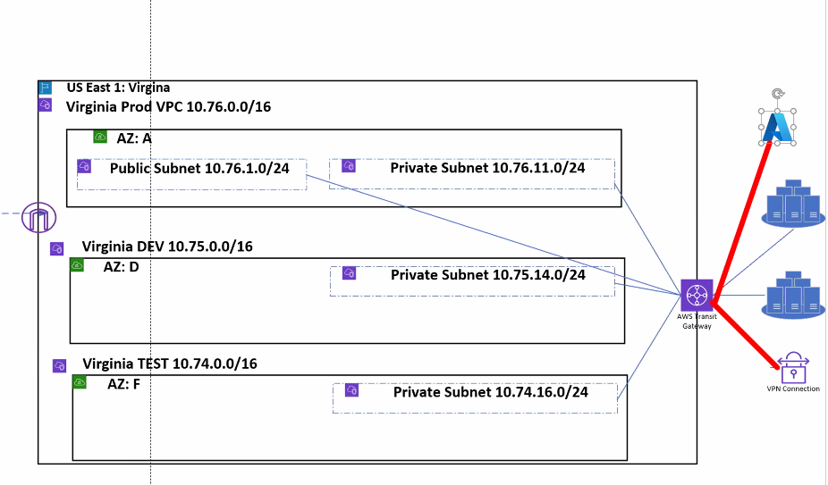

## 

# VPC and Subnet Configuration

## VPC1: Production Environment
- **CIDR Block**: `10.9.0.0/16`
- **Public Subnet**: `10.9.1.0/24` (e.g., for internet-facing applications)
  - This subnet will host a **Windows instance** serving as a **bastion host** for administrative access to internal resources.
- **Private Subnet**: `10.9.11.0/24` (for internal services)
  - This subnet will host backend systems or services that do not require direct public access.

### Considerations:
- The **Windows bastion host** will allow secure **RDP access** to developers and admins.
- The **public subnet** will also manage external traffic through an **Application Load Balancer (ALB)**, but in this scenario, no other public-facing services or instances are deployed.
- No other instances besides the bastion host are deployed in the **Production VPC**.

---

## VPC2: Development Environment
- **CIDR Block**: `10.8.0.0/16`
- **Private Subnet**: `10.8.14.0/24` (for development services)
  - This subnet will host a single **Linux instance** used for development purposes.
  - The instance will not be exposed to the internet directly but will be accessible via the **bastion host** through the Transit Gateway.

### Linux Instance Security Group:
- **Inbound Rules**:
  - Allow **SSH (port 22)** from the bastion host (private IP of the bastion host).
  - Allow **HTTP (port 80)** from the bastion host or other authorized internal sources if needed.
  - Allow **ICMP (ping)** from the bastion host to verify connectivity.

- **Outbound Rules**:
  - Allow all outbound traffic by default (to maintain connectivity for responses).

### Considerations:
- The **Linux instance** will serve as the only resource in the **Development VPC**.
- The **Linux instance** will use a **user data script** to configure a simple webpage. This script will automatically install a web server (e.g., Apache) and serve a basic webpage on port 80.
- The **bastion host** will be used to access the **Linux instance** for administrative tasks, testing, or to verify that the webpage is up and running.

---

## VPC3: Test Environment
- **CIDR Block**: `10.7.0.0/16`
- **Private Subnet**: `10.7.16.0/24` (for testing services)
  - No instances will be deployed in this VPC initially, but it is set up for future testing purposes and can be connected via the Transit Gateway.

---

## Instances and Infrastructure Configuration

### Windows Bastion Host:
- **Location**: The bastion host will be deployed in the **public subnet of the Production VPC (10.9.1.0/24)**.
- **Purpose**: It will allow secure RDP access to the private resources in the other VPCs.
- **RDP Access**: Security Group rules should allow **RDP (port 3389)** from trusted IP addresses (such as the developers' office IPs).

### Linux Development Instance:
- **Location**: The Linux instance will reside in the **private subnet of the Development VPC (10.8.14.0/24)**.
- **Security Group**: The security group for the Linux instance will allow **SSH (port 22)**, **HTTP (port 80)**, and **ICMP (ping)**, but only from the bastion host's private IP.
- **Purpose**: This instance will be used for internal development purposes and will not be exposed to the public internet.

---

## Transit Gateway Configuration
- A **Transit Gateway** will be configured to allow communication between the three VPCs (Production, Development, and Test).
- Once the Transit Gateway is established:
  - Traffic between the **bastion host in the Production VPC** and the **Linux development instance in the Development VPC** will be routed through the gateway.
  - You can RDP into the **bastion host** and then SSH into the **Linux development instance**, as well as test connectivity via **ICMP (ping)**.

### Routing:
- Ensure the **route tables** in each VPC are updated to forward traffic destined for other VPCs through the Transit Gateway.
- Each VPC’s **private subnets** must route inter-VPC traffic through the Transit Gateway.

---

## Production VPC Console Selections

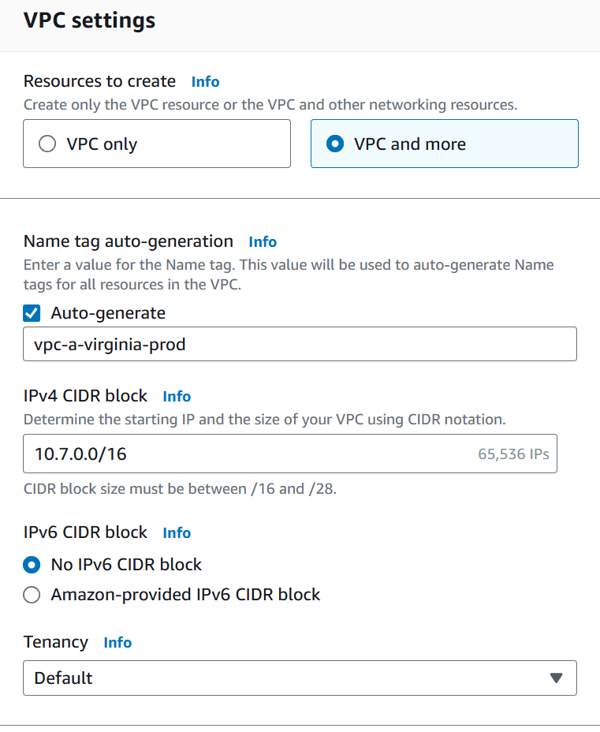
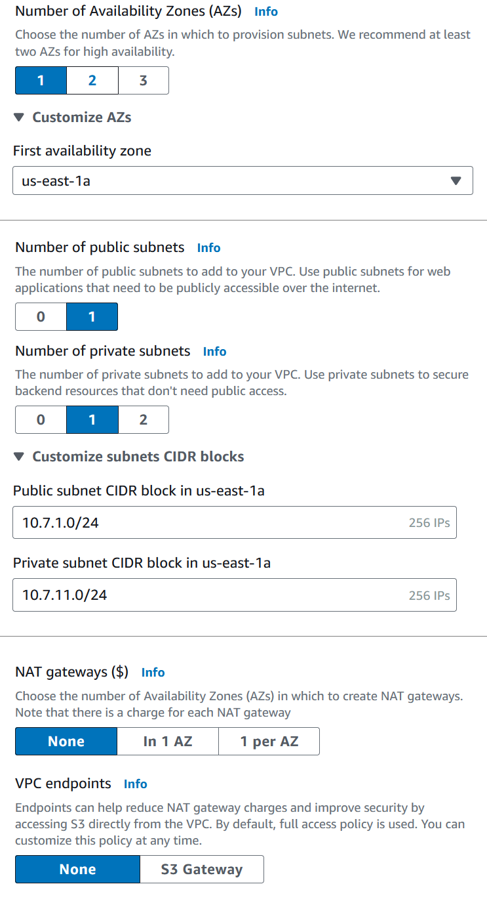
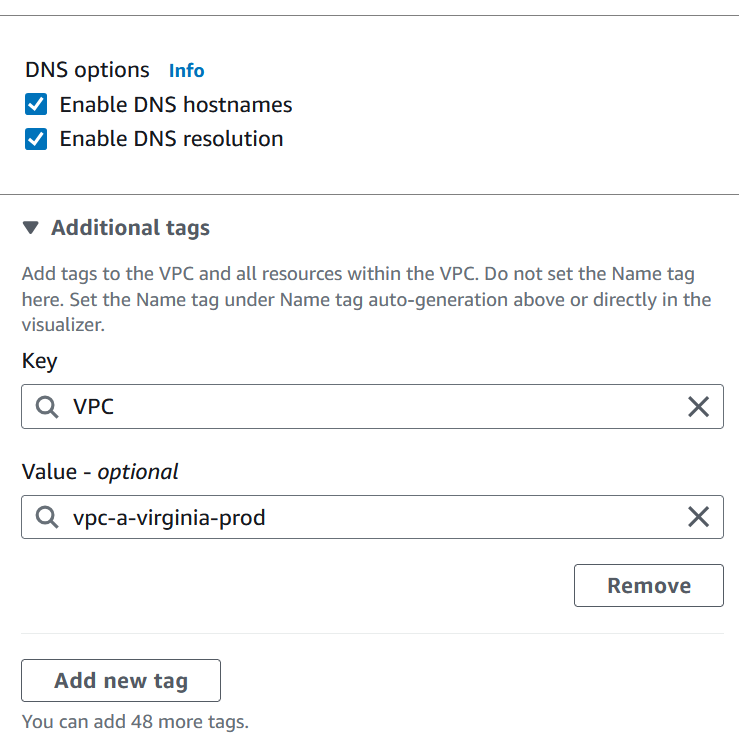
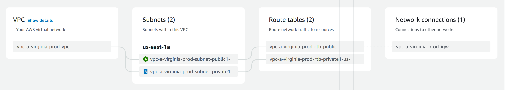
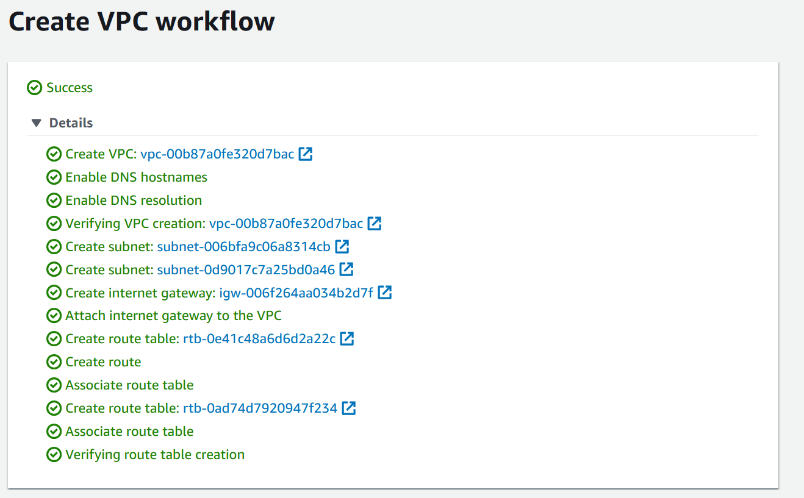
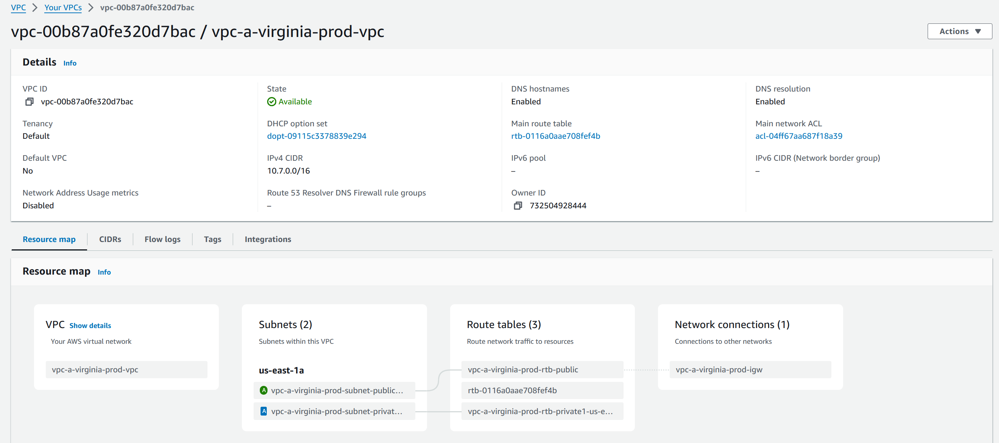

## Production VPC Creation - ***Here's what we selected:***

- **Resources to Create**: VPC and More  # This will display the planning diagram.
- **Name**: `vpc-a-virginia-prod`  # Custom name for production VPC.
- **IPv4 CIDR Block**: `10.0.0.0/16`  # Defines the IP address range for the VPC.
- **IPv6 CIDR Block**: No IPv6  # No IPv6 block needed for this VPC.
- **Tenancy**: Default  # Use default (shared) tenancy for EC2 instances.
- **Public Subnets**: 1  # One public subnet for internet-facing resources.
  - **Subnet CIDR Block**: `10.7.1.0/24` (in `us-east-1a`)  # IP range for the public subnet.
- **Private Subnets**: 1  # One private subnet for internal resources.
- **NAT Gateway**: None  # No NAT gateway needed as private instances won't access the internet.
- **DNS Hostnames**: Enabled  # Enable DNS hostnames for EC2 instances.
- **DNS Resolution**: Enabled  # Ensure internal DNS resolution.
- **Tags**:  
  - **Key**: `vpc`  
  - **Value**: `vpc-a-virginia-prod`  # Custom tag for resource identification.

Click **Create VPC** to finalize the configuration.

---

# Development VPC Console Selections:
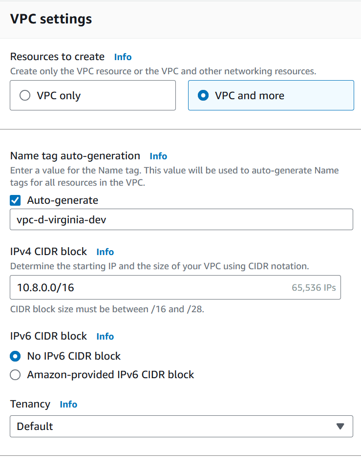
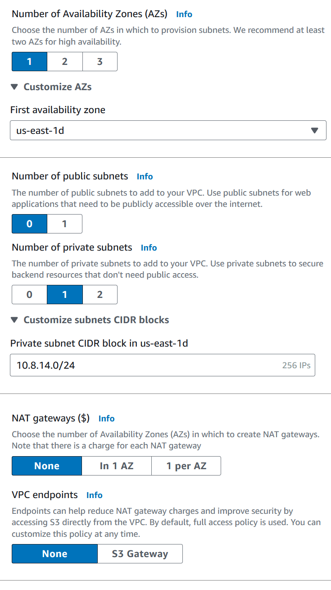

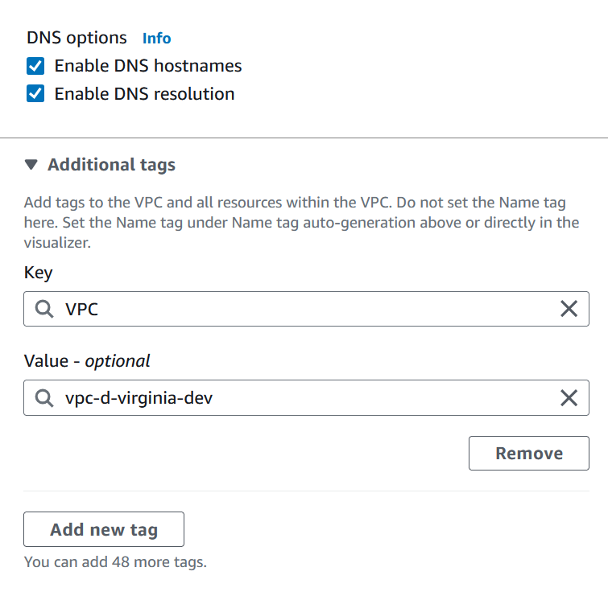
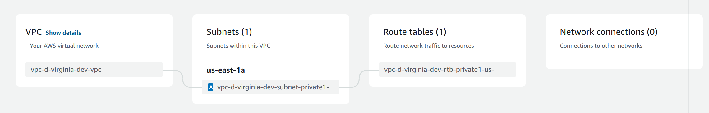
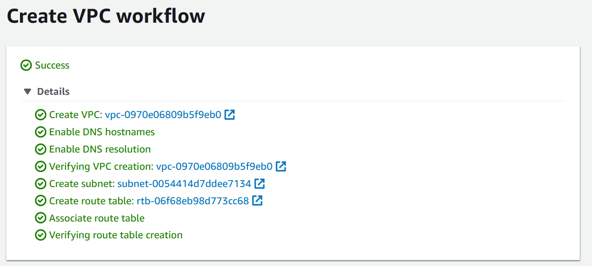
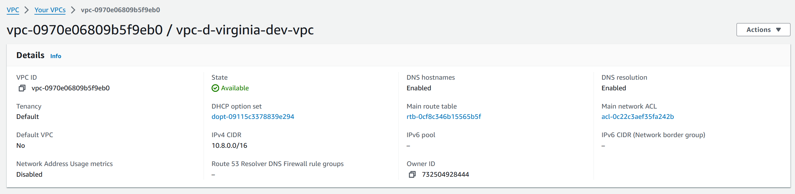

### Here's what we selected for the Development VPC:
## VPC Creation - Console Selections (Development Environment)

- **Resources to Create**: VPC and More  # This will display the planning diagram.
- **Name**: `vpc-d-virginia-dev`  # Custom name for development VPC.
- **IPv4 CIDR Block**: `10.8.0.0/16`  # Defines the IP address range for the development VPC.
- **IPv6 CIDR Block**: No IPv6  # No IPv6 block needed for this VPC.
- **Tenancy**: Default  # Use default (shared) tenancy for EC2 instances.
- **Public Subnets**: None  # No public subnet as this is for internal development.
- **Private Subnets**: 1  # One private subnet for internal resources.
  - **Subnet CIDR Block**: `10.8.14.0/24` (in `us-east-1d`)  # IP range for the private subnet in AZ `us-east-1d`.
- **NAT Gateway**: None  # No NAT gateway as private instances won't access the internet.
- **DNS Hostnames**: Enabled  # Enable DNS hostnames for EC2 instances.
- **DNS Resolution**: Enabled  # Ensure internal DNS resolution.
- **Tags**:  
  - **Key**: `vpc`  
  - **Value**: `vpc-d-virginia-dev`  # Custom tag for resource identification.

Click **Create VPC** to finalize the configuration.

# Test VPC Console Selections:

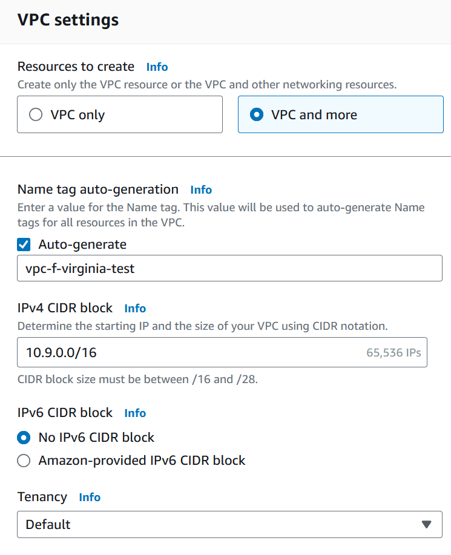

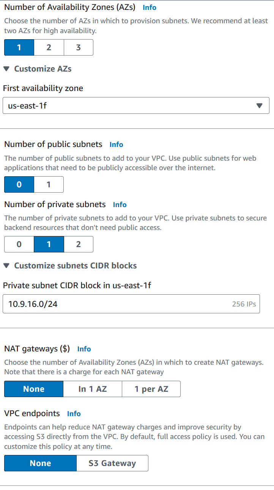
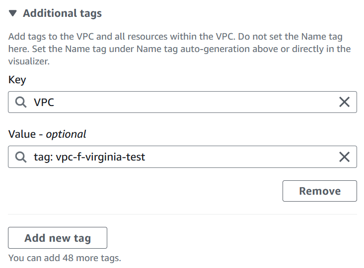
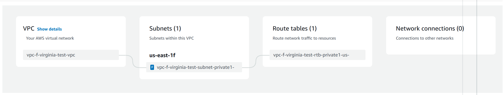
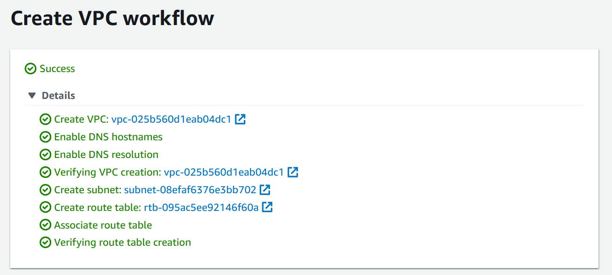
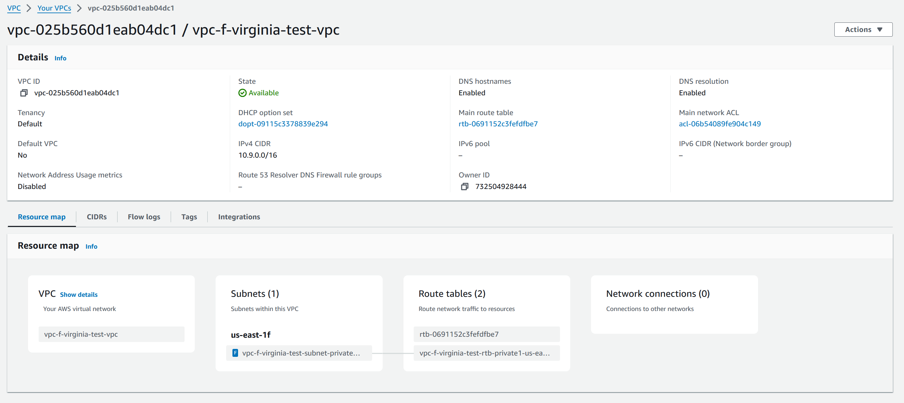

## Here's what we selected for the Test VPC:
## VPC Creation - Console Selections (Test Environment)

- **Resources to Create**: VPC and More  # This will display the planning diagram.
- **Name**: `vpc-f-virginia-test`  # Custom name for test VPC.
- **IPv4 CIDR Block**: `10.9.0.0/16`  # Defines the IP address range for the test VPC.
- **IPv6 CIDR Block**: No IPv6  # No IPv6 block needed for this VPC.
- **Tenancy**: Default  # Use default (shared) tenancy for EC2 instances.
- **Public Subnets**: None  # No public subnet as this is for internal testing.
- **Private Subnets**: 1  # One private subnet for internal resources.
  - **Subnet CIDR Block**: `10.9.16.0/24` (in `us-east-1f`)  # IP range for the private subnet in AZ `us-east-1f`.
- **NAT Gateway**: None  # No NAT gateway as private instances won't access the internet.
- **DNS Hostnames**: Enabled  # Enable DNS hostnames for EC2 instances.
- **DNS Resolution**: Enabled  # Ensure internal DNS resolution.
- **Tags**:  
  - **Key**: `vpc`  
  - **Value**: `vpc-f-virginia-test`  # Custom tag for resource identification.

Click **Create VPC** to finalize the configuration.

## Here are Our Created VPC's
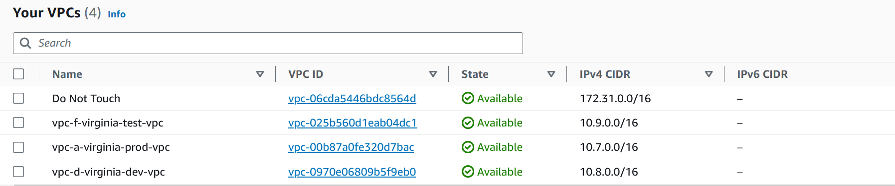
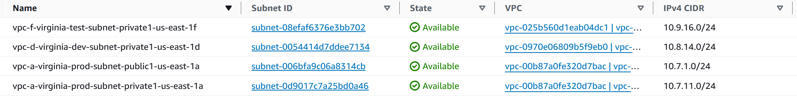

# Setting Up AWS Transit Gateway with Production, Development, and Test VPCs

## Next we need to create the Transit Gateway.
 Remember (TGW) is a network transit hub that interconnects attachments (VPCs and VPNs) within the same AWS account or across AWS accounts.

## Details

1. Log in to the AWS Management Console.
2. Navigate to VPC and select **Transit Gateways**.
3. Click **Create Transit Gateway**.
4. Fill in the following details:
   - **Name tag**: us-tgw-01
   - **Description**: us-tgw-01
   - **Amazon side Autonomous System Number (ASN)**:  (Note: We will not be using an ASN, so this can be left as default...unless you're a seasoned Cisco network developer!)
   - **DNS support**: Enable.
   - **Security Group Referencing support**: Info (leave default settings).
   - **VPN ECMP support**: Info (leave default settings).
   - **Default route table association**: Info (leave default settings).
   - **Default route table propagation**: Info (leave default settings).
   - **Multicast support**: Info (leave default settings).
   - **Auto accept shared attachments**: Disabled (unless needed for cross-account sharing).
   - **Transit gateway CIDR blocks**: 
     - **CIDR**: 10.0.0.0/8
5. Click **Create Transit Gateway**. The status will be **Pending** until the gateway is fully created.

### Tags - Optional:
You can add tags to help organize and track your AWS resources. Each tag consists of a key and an optional value. You can add up to 49 additional tags.
- **Key**: Name
- **Value**: us-tgw-01

---

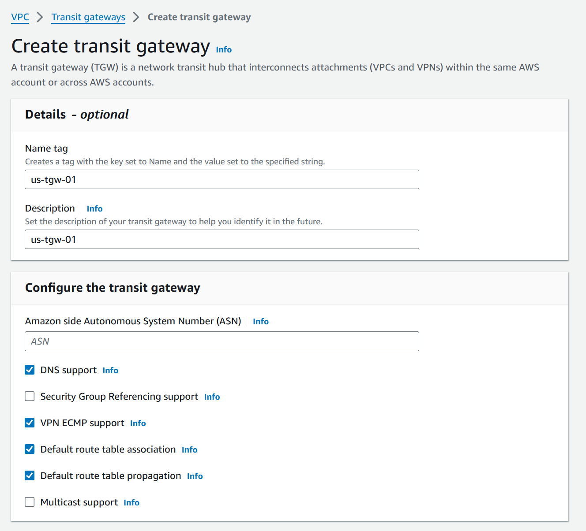

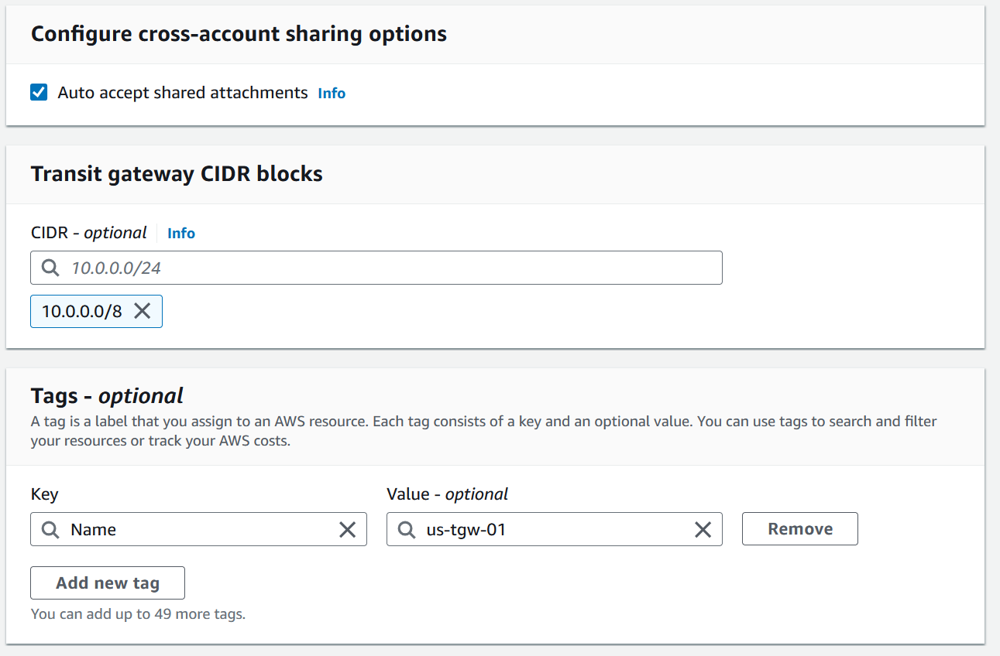

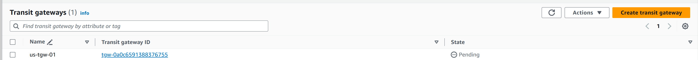

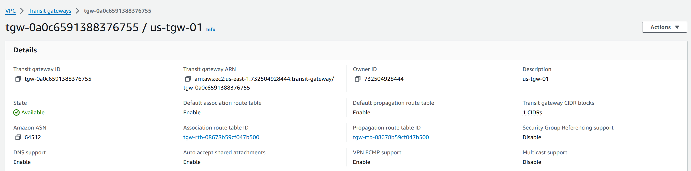

## Step 2: Attach VPCs to the Transit Gateway

### 1. Attach VPC1 (Production) to Transit Gateway:
1. Navigate to **Transit Gateway Attachments**.
2. Click **Create Transit Gateway Attachment**.
3. Configure the settings:
   - **Transit Gateway ID**: Select your Main-Transit-Gateway (tgw-0a0c6591388376755).
   - **Attachment type**: **VPC**.
   - **VPC ID**: Select **vpc-a-virginia-prod**.
   - **Subnet IDs**: Choose the following:
     - **Public Subnet**: `10.7.1.0/24`
     - **Private Subnet**: `10.7.11.0/24`
4. Click **Create attachment**.
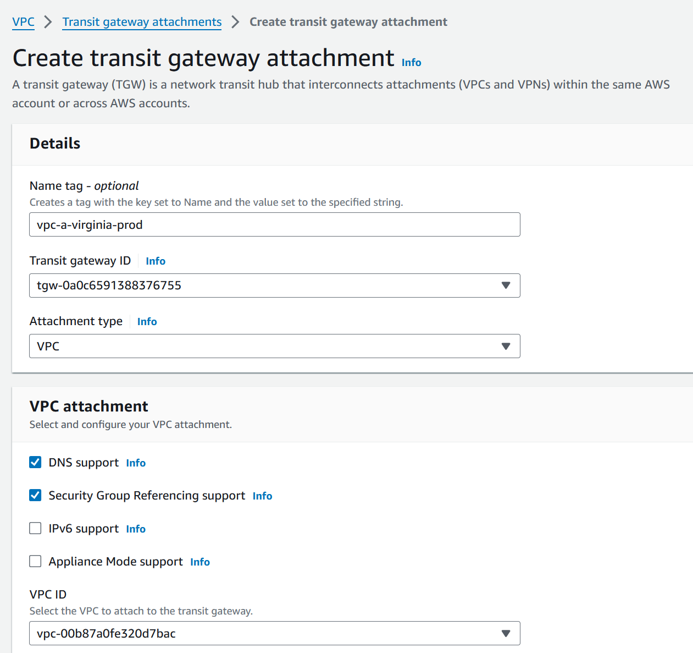
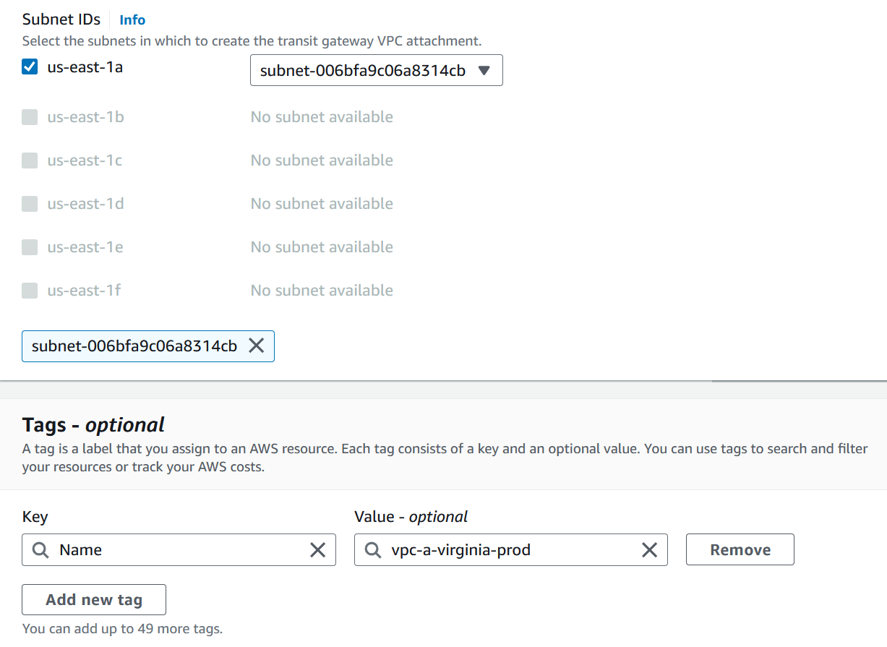
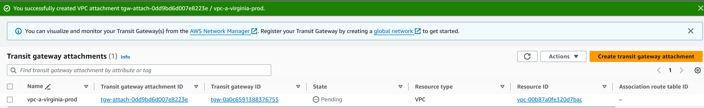
### 2. Attach VPC2 (Development) to Transit Gateway:
1. Repeat the steps for creating a Transit Gateway Attachment.
2. Choose the **VPC2 (Development)**.
3. Select the subnet:
   - **Private Subnet**: `10.8.14.0/24`
4. Click **Create attachment**.
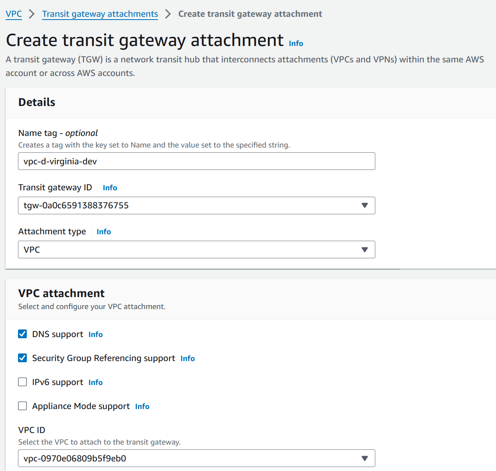
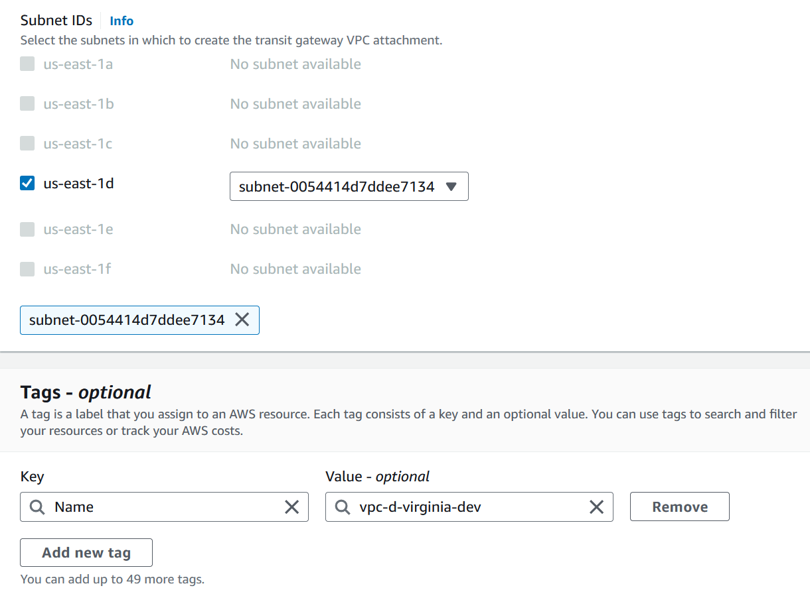
### 3. Attach VPC3 (Test) to Transit Gateway:
1. Repeat the steps for creating a Transit Gateway Attachment.
2. Choose the **VPC3 (Test)**.
3. Select the subnet:
   - **Private Subnet**: `10.9.16.0/24`
4. Click **Create attachment**.

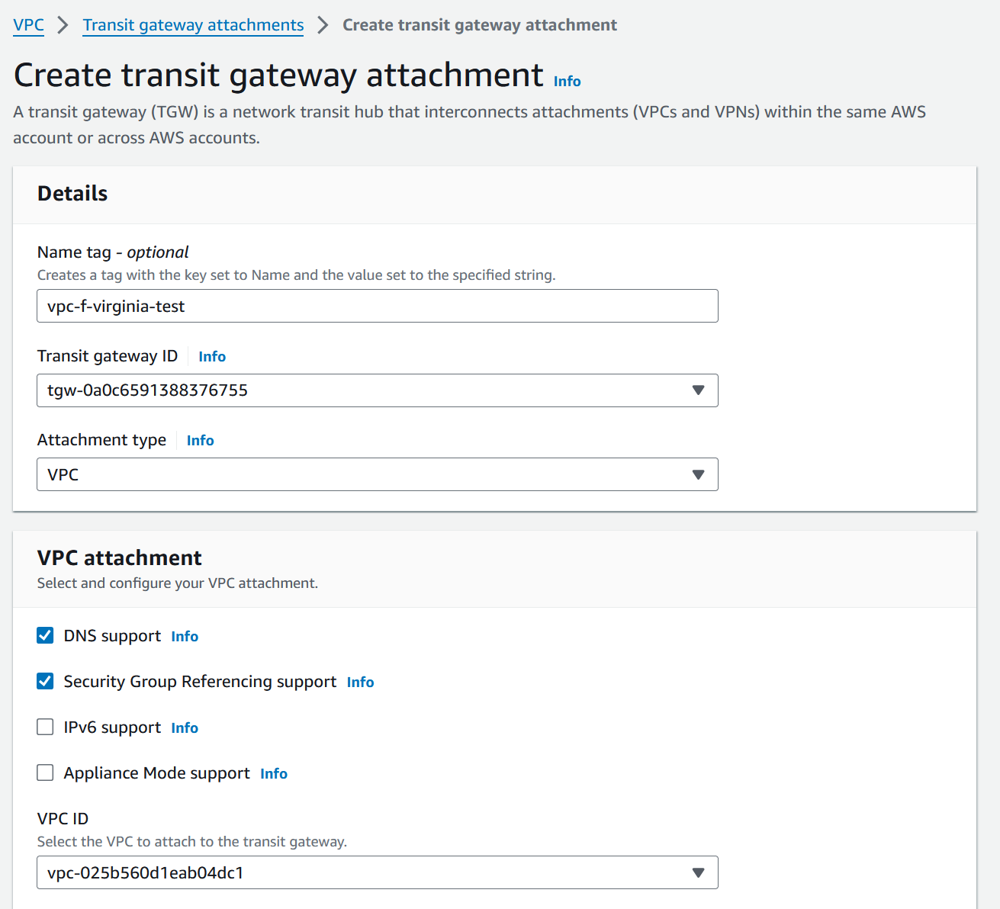
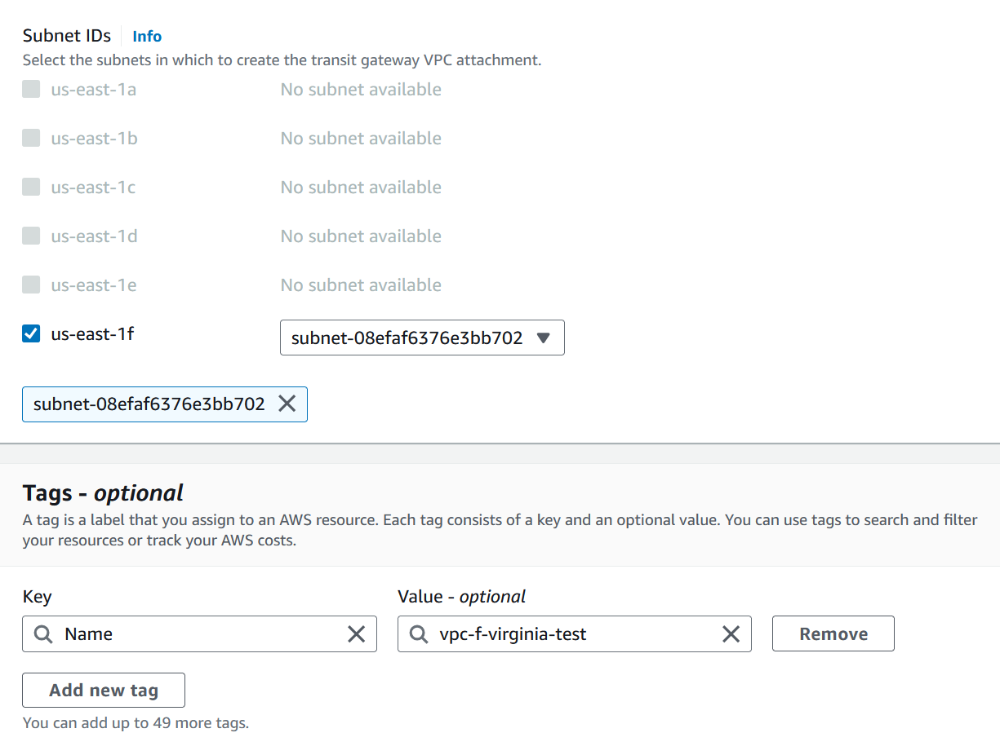

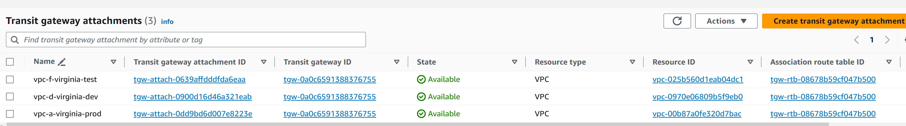
---

# Step 3: Create and Configure Transit Gateway Route Tables
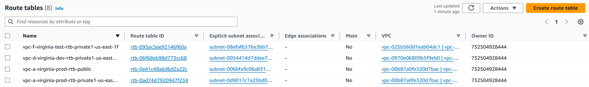

***Note: After attaching the VPCs to the Transit Gateway, the next step is to create a Transit Gateway Route Table. This route table will define the routes for traffic between the VPCs connected to the Transit Gateway.
At this point, there is an existing route table displaying the routes from the Internet Gateway (IGW) to the CIDR ranges of the VPCs. This route table will be updated to include new routes associated with the Transit Gateway.***

## Console Settings

1. **Access Routing Tables:**
   - Click on **Route Tables** in the left-hand menu.

2. **Select Your Transit Gateway Route Table:**
   - Identify and select the route table associated with your Transit Gateway.

3. **Review Existing Routes:**
   - Check the existing routes listed in the route table.

4. **Add New Routes:**
   - Click on **Edit Routes** to modify the routing table.
   - Add the following routes:
     - For the **Prod VPC**:
       - **Destination**: 10.7.0.0/16
       - **Target**: Local
     - For **Internet Access**:
       - **Destination**: 0.0.0.0/0
       - **Target**: Internet Gateway (IGW)
     - For **Transit Gateway Communication**:
       - **Destination**: 10.0.0.0/8
       - **Target**: Transit Gateway (TGW)

5. **Save Changes:**
   - After adding the routes, click **Save Routes** to apply the changes.

6. **Verify Configuration:**
   - Ensure that the new routes are correctly listed in the route table and that the targets are as expected.
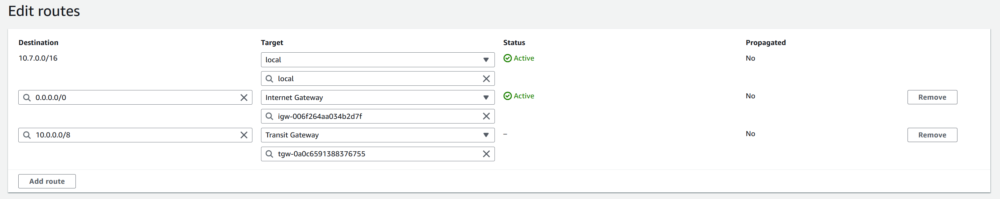
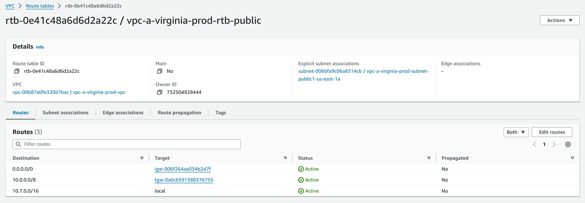

---

## Step 4: Update VPC Route Tables for Transit Gateway Traffic

For each VPC (Production, Development, and Test), update their respective route tables to direct traffic through the Transit Gateway.

### 1. Update VPCA (Production) Route Table:
1. Navigate to **VPC** > **Route Tables**.
2. Select the route table for **VPC1 (Production)** and click **Edit routes**.
3. Add routes:
   - **Destination**: `10.8.0.0/16` (Development VPC), **Target**: **Main-Transit-Gateway**.
   - **Destination**: `10.0.0.0/8` (Test VPC), **Target**: **Main-Transit-Gateway**.
4. Click **Save routes**.

### 2. Update VPCD (Development) Route Table:
1. Repeat the above steps for **VPC2 (Development)** route table.
2. Add routes:
   - **Destination**: `10.9.0.0/16` (Production VPC), **Target**: **Main-Transit-Gateway**.
   - **Destination**: `10.0.0.0/8` (Test VPC), **Target**: **Main-Transit-Gateway**.
3. Click **Save routes**.
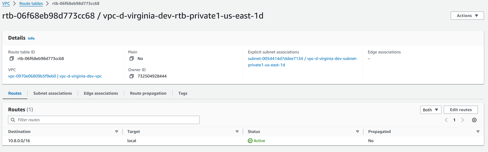
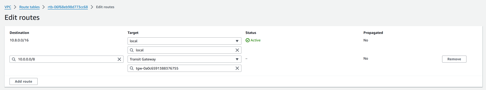
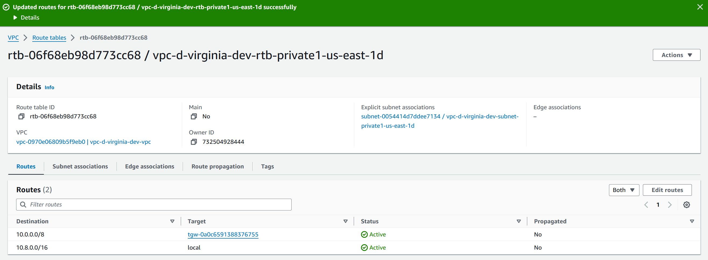
### 3. Update VPCF (Test) Route Table:
1. Repeat the steps for the **VPC3 (Test)** route table.
2. Add routes:
   - **Destination**: `10.9.0.0/16` (Production VPC), **Target**: **Main-Transit-Gateway**.
   - **Destination**: `10.0.0.0/8` (Development VPC), **Target**: **Main-Transit-Gateway**.
3. Click **Save routes**.
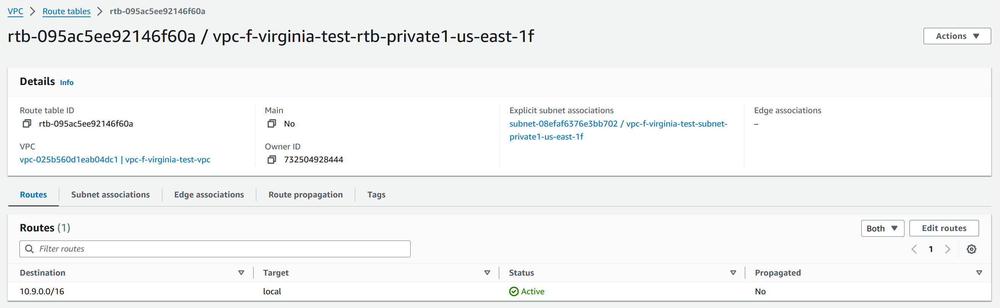
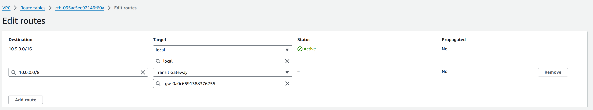
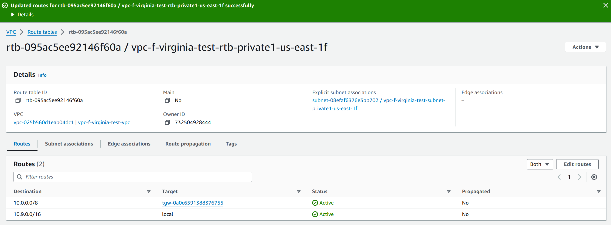
---

### All routes created
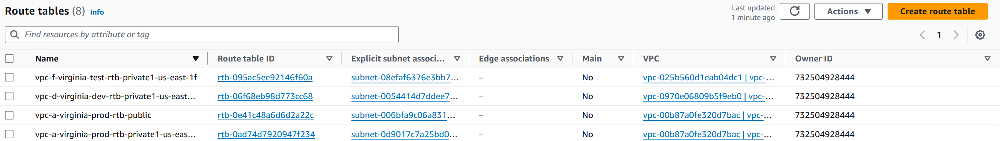

### Note: ASN

***When creating a Transit Gateway in AWS, an Autonomous System Number (ASN) is typically required to identify the gateway in Border Gateway Protocol (BGP) routing. The ASN helps facilitate the dynamic routing of traffic between different VPCs and on-premises networks. However, in our scenario with the three VPCs (Production, Development, and Test) all operating within the same AWS environment, the use of an ASN is not necessary. This is because our setup does not require dynamic routing; we can effectively manage connectivity between the VPCs through static routes configured in the Transit Gateway.***

## Conclusion

By following these steps, you will have successfully created a Transit Gateway connecting the Production, Development, and Test VPCs. Each VPC is attached to the Transit Gateway using its specific subnets, and routing tables are updated to ensure seamless communication between the environments.

## Instances

# Security Group Configuration for Development Subnet Instance

When creating instances in the Development subnet, it's important to set up a security group that allows the necessary traffic for proper functionality and communication. Here’s how to configure the security group:

## Step 1: Create Security Group

1. **Navigate to the Security Groups section** under the VPC Dashboard.
2. **Click on Create Security Group.**
3. **Fill in the details:**
   - **Name Tag**: Dev-Instance-SG
   - **Description**: Security Group for Development Subnet Instances
   - **VPC**: Select the Development VPC (VPC2)

## Step 2: Add Inbound Rules

You need to configure the inbound rules to allow specific types of traffic:

1. **Allow ICMP (Ping)**
   - **Type**: All ICMP
   - **Source**: 10.0.0.0/8 (This allows ICMP traffic from any instance in the Transit Gateway CIDR, enabling ping requests for diagnostics.)

2. **Allow SSH Access**
   - **Type**: SSH
   - **Protocol**: TCP
   - **Port Range**: 22
   - **Source**: 10.0.0.0/8 (This allows SSH access from any instance within the Transit Gateway CIDR, enabling secure remote management.)

3. **Allow HTTP Traffic**
   - **Type**: HTTP
   - **Protocol**: TCP
   - **Port Range**: 80
   - **Source**: 10.0.0.0/8 (This allows HTTP traffic from any instance within the Transit Gateway CIDR, enabling web traffic for applications.)

## Source 10.0.0.0/8
By allowing traffic from the CIDR block of the Transit Gateway (10.0.0.0/8), your instances in the Development subnet will be able to communicate with instances in other VPCs connected to the Transit Gateway. This configuration enhances connectivity while maintaining security by restricting access to only specified types of traffic.

   - **ICMP**: Allow incoming ICMP traffic (for ping).
     - **Source**: `10.0.0.0/8` (Transit Gateway CIDR)
   - **SSH**: Allow incoming SSH traffic (for remote access).
     - **Source**: `10.0.0.0/8` (Transit Gateway CIDR)
   - **HTTP**: Allow incoming HTTP traffic (for web access).
     - **Source**: `10.0.0.0/8` (Transit Gateway CIDR)

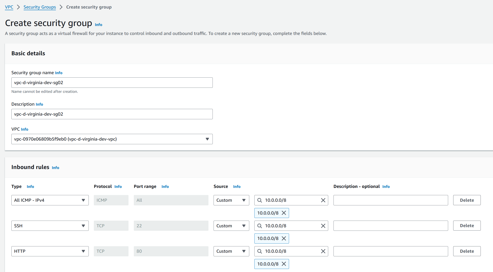

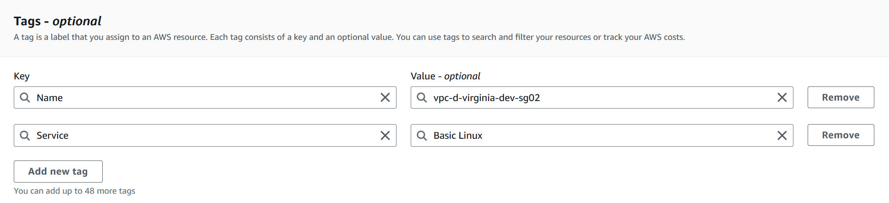

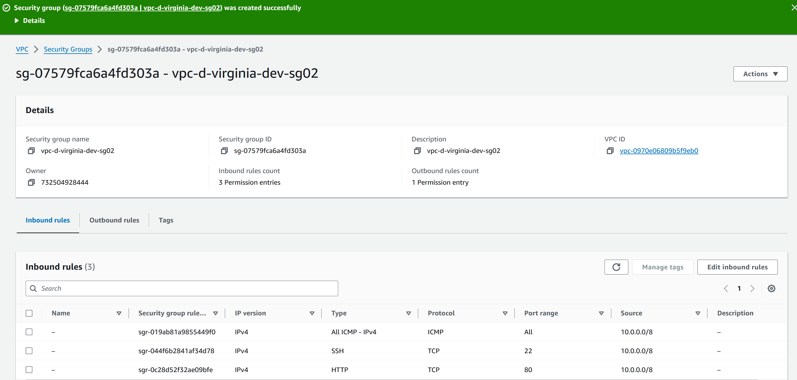

# Step 1: Create Security Group
Navigate to the Security Groups section under the VPC Dashboard.

Click on **Create Security Group For Production Bastion**.

Fill in the details:
- **Name Tag**: Prod-Bastion-SG
- **Description**: Security Group for Production Bastion Instance
- **VPC**: Select the Production VPC (VPC1)

# Step 2: Add Inbound Rules
You need to configure the inbound rules to allow specific types of traffic for RDP and ping access:

## Allow ICMP (Ping) Optional, you will be pinging the DEV instance (not vice versa, unless you simplt want to test the connection in reverse order)
- **Type**: All ICMP - IPv4
- **Source**: Custom (specify internal subnet range, e.g., 10.0.0.0/16)  
  (This allows ICMP traffic only from within your internal network to ensure ping requests for diagnostics.)

## Allow RDP Access
- **Type**: RDP
- **Protocol**: TCP
- **Port Range**: 3389
- **Source**: Custom (specify internal subnet range or trusted IPs)  
  (This allows secure RDP access only from your internal network or trusted IPs to the Windows instance.)

By allowing traffic from 0.0.0.0/0, your bastion instance will be accessible from any device on the internet, enabling you to manage it remotely. Ensure to monitor access and consider implementing additional security measures, such as limiting access to specific IP addresses when possible, to enhance security.

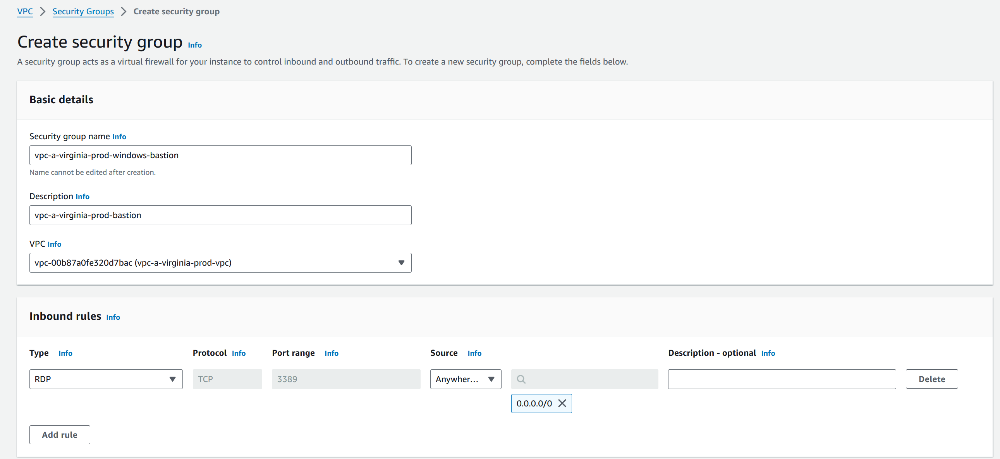
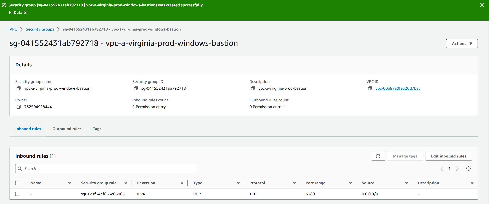

# Launching your EC2 Instances

## Step 1: Name and Tags
- **Name**: Provide a name for your instance.
- **Tags**: (Optional) Add tags to help organize and identify your instance.

## Step 2: Select an AMI (Amazon Machine Image)
- Choose an AMI that suits your operating system or application needs.
  - **Example**: Microsoft Windows 2022 Datacenter edition.
  - **AMI ID**: `ami-0324a83b82023f0b3`

## Step 3: Choose an Instance Type
- Select the instance type depending on your performance requirements.
  - **Example**: `t2.micro` for low-cost, small workloads or `m5.large` for higher performance.

## Step 4: Key Pair (Login)
- Choose an existing key pair or create a new one.
  - Ensure you have access to the key pair for SSH (Linux) or RDP (Windows) connections.

## Step 5: Configure Network Settings
- **VPC**: Select the Virtual Private Cloud (VPC) where the instance will reside.
- **Subnet**: Choose the appropriate subnet for your instance.
- **Auto-assign Public IP**: Enable if your instance needs to be accessible from the internet.
- **Security Group**: select an existing one.

## Let's launch the instances

### 1. The first instance will be launched in the Production VPC's public subnet.

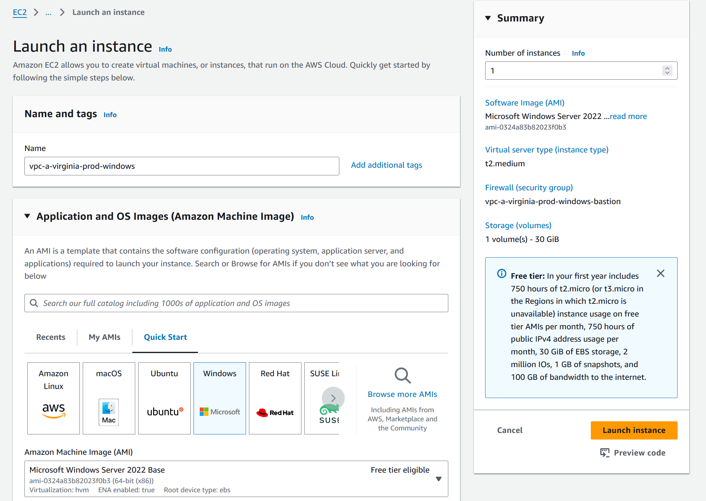

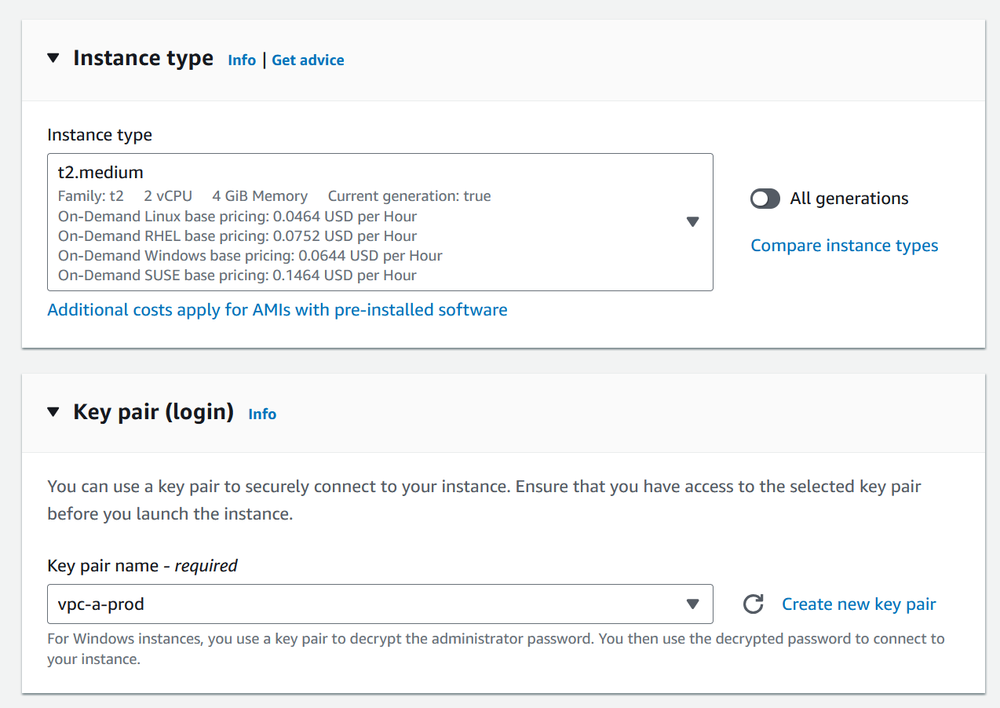

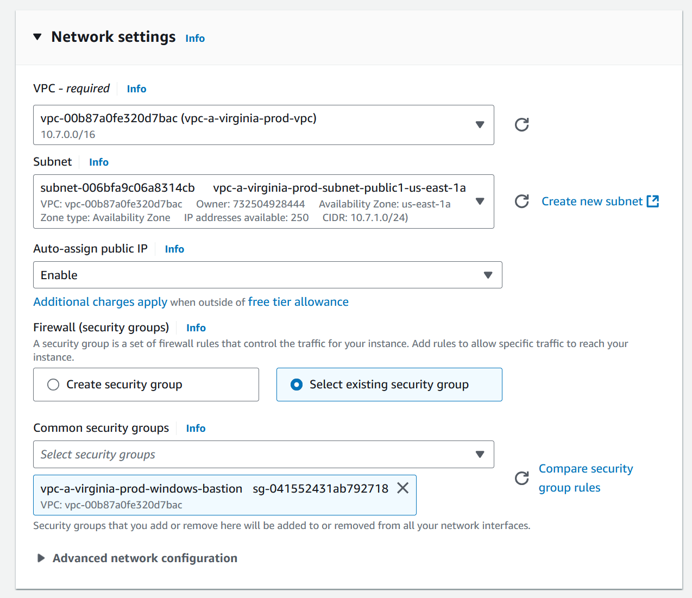
### 2. The second instance will be launched in the Development VPC's private subnet.
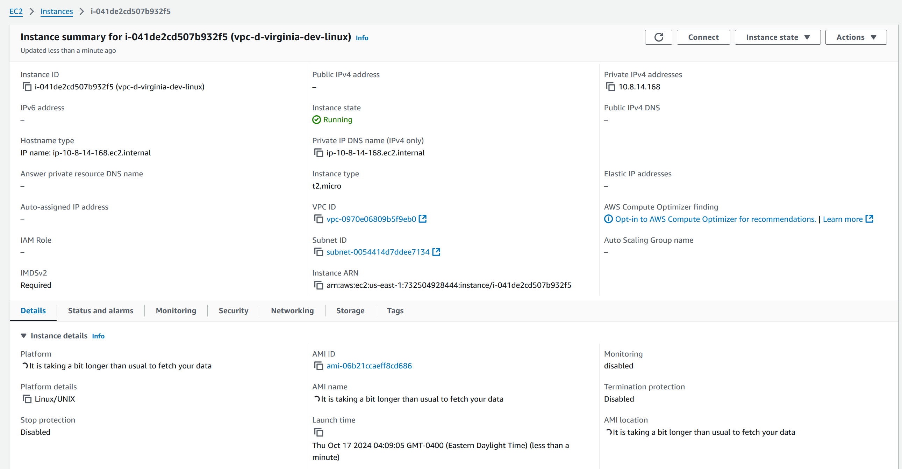

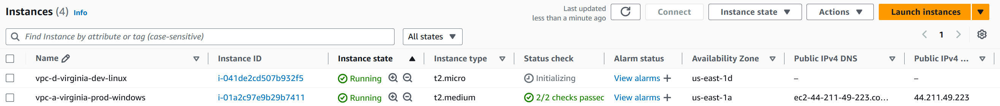

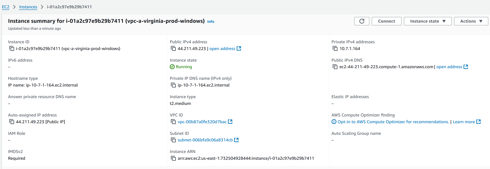

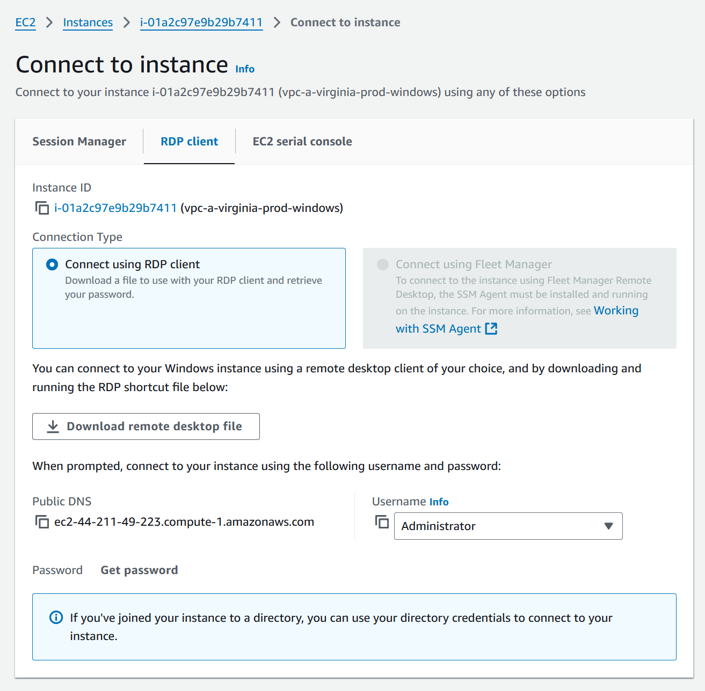

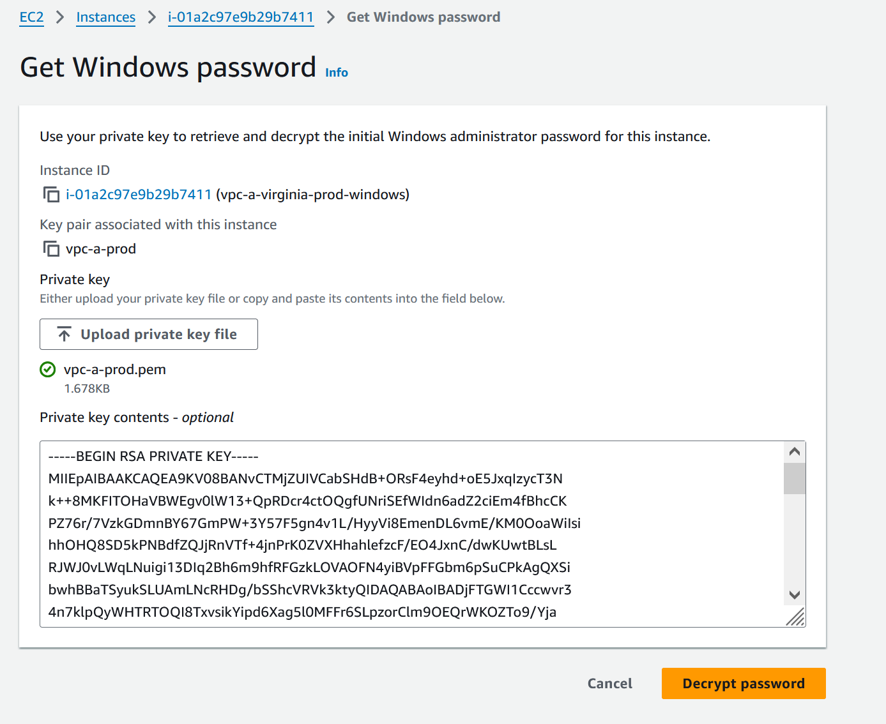

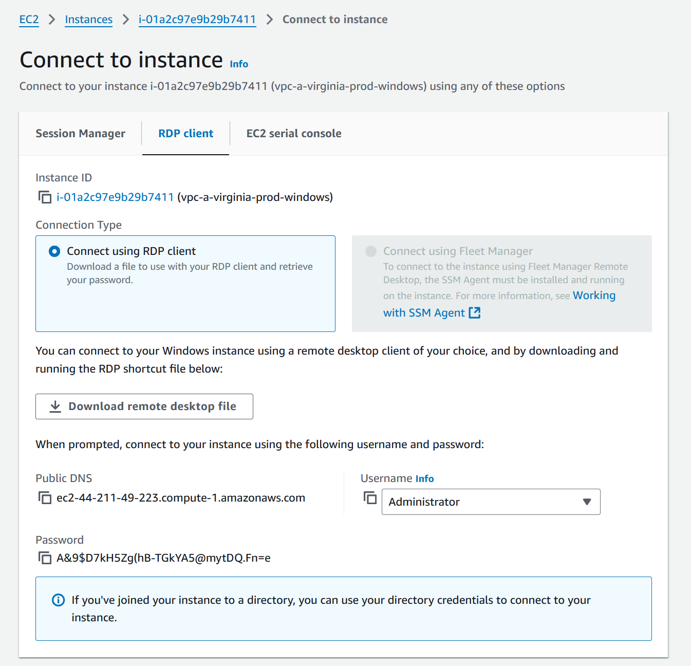

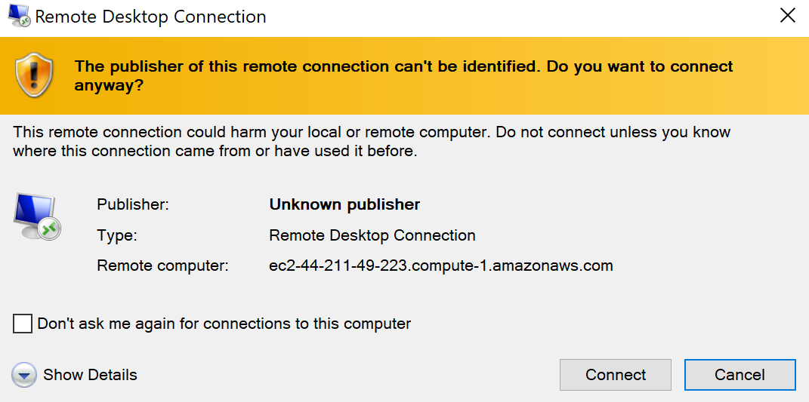
#
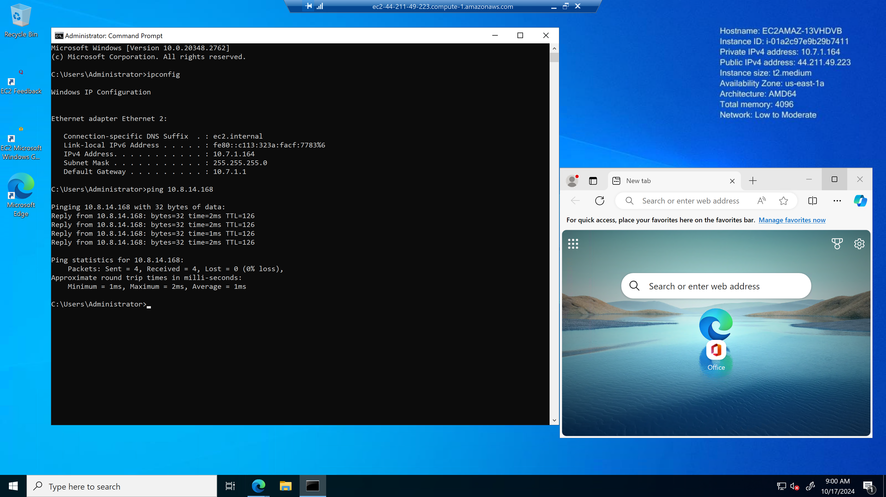

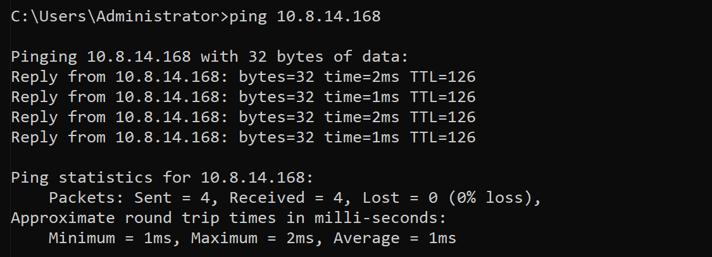

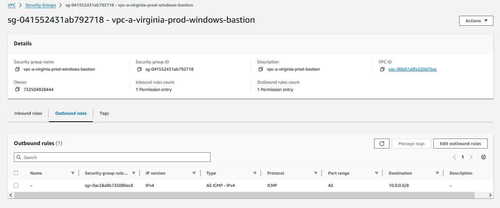

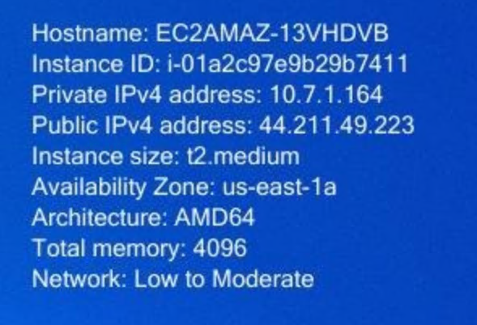