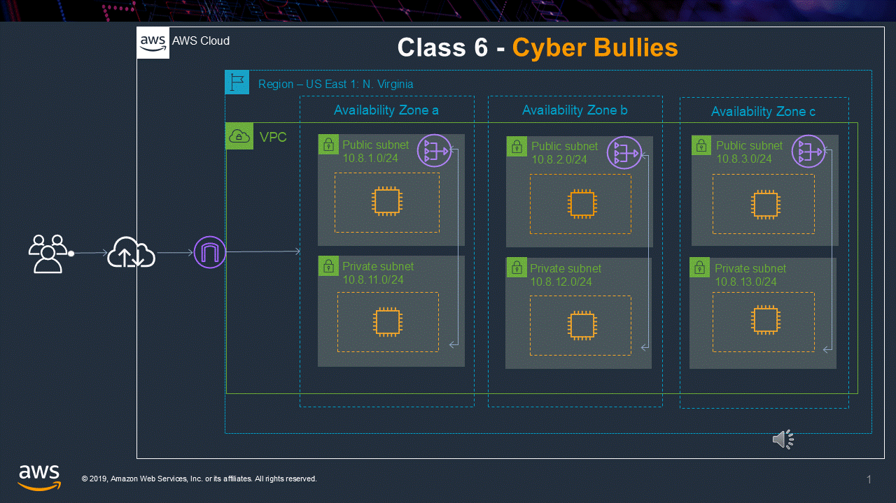

# N Virginia - us-east-1

## CIDR Block
- **VPC CIDR**: `10.8.0.0/16`

## Availability Zones and Subnets

### AZ-a
- **Public Subnet**: `10.8.1.0/24`
- **Private Subnet**: `10.8.11.0/24`

### AZ-b
- **Public Subnet**: `10.8.2.0/24`
- **Private Subnet**: `10.8.12.0/24`

### AZ-a (Additional)
- **Public Subnet**: `10.8.3.0/24`
- **Private Subnet**: `10.8.13.0/24`

## Click Here:
https://media4.giphy.com/media/v1.Y2lkPTc5MGI3NjExN2t6NXpweWttYnMwb2p0bzhvYnAwM2p0czcyemd0Y2ZoZWx5Y2dudiZlcD12MV9pbnRlcm5hbF9naWZfYnlfaWQmY3Q9Zw/4TOLclVSxExTCjaqV7/giphy.webp