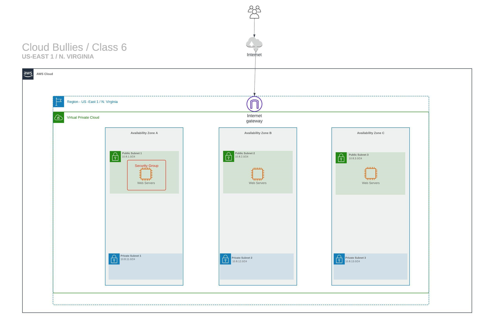
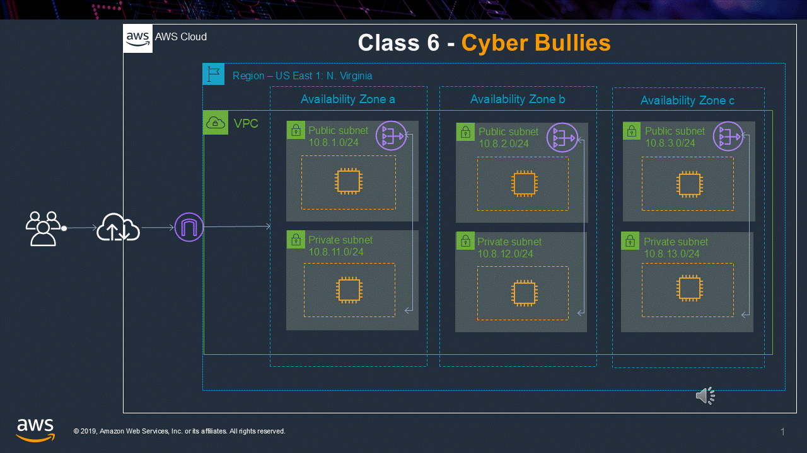

# N Virginia - us-east-1

## CIDR Block
- **VPC CIDR**: `10.8.0.0/16`

## Availability Zones and Subnets

### AZ-a
- **Public Subnet**: `10.8.1.0/24`
- **Private Subnet**: `10.8.11.0/24`

### AZ-b
- **Public Subnet**: `10.8.2.0/24`
- **Private Subnet**: `10.8.12.0/24`

### AZ-c
- **Public Subnet**: `10.8.3.0/24`
- **Private Subnet**: `10.8.13.0/24`

https://lucid.app/lucidchart/7382af1b-74d8-434e-b8d8-38aa459756b4/edit?invitationId=inv_a60c6934-7290-4e77-872f-b566f59f674f

