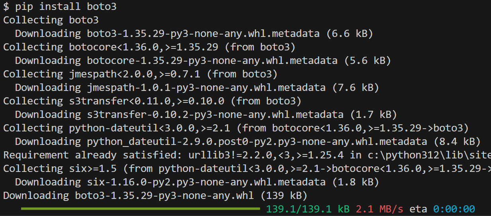
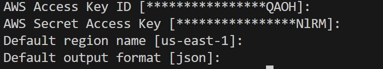

# Volume Snapshot Process

### Prerequisites: 

***-AWS CLI***

***-AWS Configure***

***-Boto3***


Ensure boto3 is installed on your local machine.

```bash
pip install boto3
```



#### Ensure AWS CLI is installed and configured first.



## Create Two EC2 Instances:

### CLI Example:

```bash
aws ec2 run-instances \
    --image-id ami-0ebfd941bbafe70c6 \
    --instance-type t2.micro \
    --key-name class6 \
    --security-group-ids sg-074dfdddb2f89fce3 \
    --subnet-id subnet-07f123df0c3aec152 \
    --region us-east-1 \
    --count 2 \
    --tag-specifications 'ResourceType=instance,Tags=[{Key=Name,Value=prod}]'

```

Commented version:
```bash
aws ec2 run-instances \  # Run a new EC2 instance
    --image-id ami-0ebfd941bbafe70c6 \  # Specify the AMI (Amazon Machine Image) ID
    --instance-type t2.micro \  # Define the instance type (e.g., t2.micro)
    --key-name class6 \  # Name of the key pair for SSH access to the instance
    --security-group-ids sg-074dfdddb2f89fce3 \  # Provide security group ID for instance firewall rules
    --subnet-id subnet-07f123df0c3aec152 \  # Specify the subnet ID for network placement
    --region us-east-1 \  # Specify the AWS region where the instance will be created
    --count 2 \  # Number of instances to launch
    --tag-specifications 'ResourceType=instance,Tags=[{Key=Name,Value=prod}]'  # Add tags for the instance (e.g., Name=prod)

```

One liner: 
```bash
aws ec2 run-instances --image-id ami-0ebfd941bbafe70c6 --instance-type t2.micro --key-name class6 --security-group-ids sg-074dfdddb2f89fce3 --subnet-id subnet-07f123df0c3aec152 --region us-east-1 --count 2 --tag-specifications 'ResourceType=instance,Tags=[{Key=Name,Value=prod}]'
```

***Let's launch two EC2 instances from the AWS CLI. Ensure they are up and running.***


#### Use this command to observe the volumes:

```bash
aws ec2 describe-volumes --region us-east-1
```

#### Use this command to observe the instances:

```bash
aws ec2 describe-instances --region us-east-1
```


### Let's create a snapshot of these volumes:
    
***To accomplish this we need to visit: 
https://boto3.amazonaws.com/v1/documentation/api/latest/reference/services/ec2.html#EC2.Client.describe_volumes***

***https://boto3.amazonaws.com/v1/documentation/api/latest/reference/services/ec2/client/create_snapshot.html#***

## First we will list all the volumes in your selected region:


#### This is a sample code to list the volumes in an specific region (in our case us-east-1):
```bash
list_volumes.py
```
```python
import boto3
import json

# Create an EC2 client
ec2_client = boto3.client('ec2', region_name='us-east-1')

# Fetch the volumes
volumes = ec2_client.describe_volumes()

# Filter volumes for a specific us-east-1 availability zone
filtered_volumes = [
    volume for volume in volumes['Volumes'] if volume['AvailabilityZone'] == 'us-east-1e'
]

# Make the JSON output readable
formatted_output = json.dumps(filtered_volumes, indent=4, default=str)

# Print the formatted output
print(formatted_output)

# Print the raw volume list
# print(volumes['Volumes'])

```


# Let's create a snapshot of each volume:


```bash
create_snapshots_by_az.py
```

# Let's create a scheduled snapshot of each volume:


```bash
create_scheduled_snapshots_by_az.py
```

# Let's clean up all the snapshots except the most recent two:


```bash
delete_old_snapshots.py
```